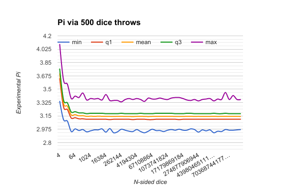

# Pi via Rand

Inspired by standupmaths video https://www.youtube.com/watch?v=RZBhSi_PwHU

My question: If you could increase the sides of the dice (keeping # of dice rolls constant), would it actually improve the calculation of Pi?

Answer: Not really, 120 sided dice was probably good enough, you just need more rolls of the dice.

Google spreadsheet with data and nice chart: https://goo.gl/Mkoqf6

