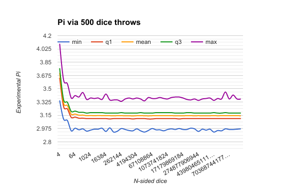
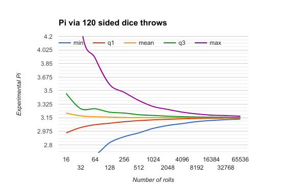

# Pi via Rand

Inspired by standupmaths video https://www.youtube.com/watch?v=RZBhSi_PwHU

My question: If you could increase the sides of the dice (keeping # of dice rolls constant), would it actually improve the calculation of Pi?

Answer: Not really, 120 sided dice was probably good enough, you just need more rolls of the dice.

Google spreadsheet with data and nice charts: https://goo.gl/Mkoqf6

Sample size was 4096 for both tests 
* 4k samples of n-sided dice with 500 rolls
* 4k samples of n-rolls with 120-sided dice

To run: 
* install golang
* `go get github.com/montanaflynn/stats`
* `go run main.go`

